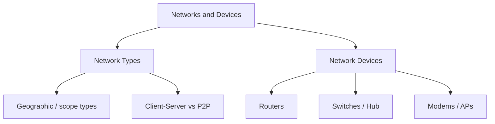

# Networks & Devices — Map of Content

This is **module 00** — what a network *is*, how we classify them, and the boxes that build them. Study this before deep terminology.

## Analogy for the whole module

> Think of networking as a **city**.
> - **Network types** = kinds of cities and roads (neighborhood vs highway vs airport Wi‑Fi).
> - **Network devices** = traffic cops, intersections, mail hubs, and radio towers that move people (data) around.

## Sections

1. [[01-Network-Types/Index|Network Types]] — LAN, WAN, MAN, WLAN, PAN, SAN, VPN, Cloud, Client‑Server, Peer‑to‑Peer
2. [[02-Network-Devices/Index|Network Devices]] — Routers, Switches, Hub, Modems, Access Points

## Study order

1. [[LAN]] → [[WAN]] → [[MAN]] (scope ladder)
2. [[WLAN]] · [[PAN]] · [[SAN]] · [[VPN]] · [[Cloud]]
3. [[Client-Server Network]] · [[Peer-to-Peer Network]]
4. [[Hub]] → [[Switches]] → [[Routers]] (dumb → smart forwarding)
5. [[Modems]] · [[Access Points]]

← [[Home]] · Next: [[01-Basic-Terminology/Index|Basic Terminology]]
