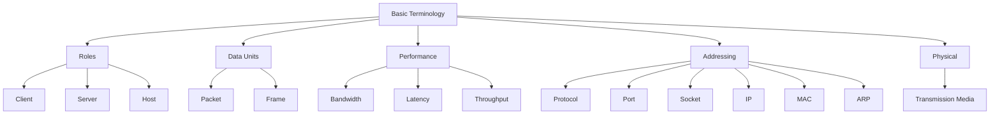

# Basic Terminology — Map of Content

Master these first. They are the vocabulary every protocol note assumes.

## Nested map



## Study order

1. [[01-Roles/Index|Roles]] — [[Client]] · [[Server]] · [[Host]]
2. [[02-Data-Units/Index|Data Units]] — [[Packet]] · [[Frame]]
3. [[03-Performance/Index|Performance]] — [[Bandwidth]] · [[Latency]] · [[Throughput]]
4. [[04-Addressing/Index|Addressing]] — [[Protocol]] · [[Port]] · [[Socket]] · [[IP Address]] · [[MAC Address]] · [[ARP]]
5. [[05-Physical/Index|Physical]] — [[Transmission Media Types]]

## Encapsulation mental model

```text
App data
  → Segment (TCP/UDP)   [ports / sockets]
  → Packet  (IP)        [IP addresses]
  → Frame   (Ethernet)  [MAC addresses + ARP]
  → Bits on media       [transmission media]
```

← [[Home]] · Prev: [[00-Networks-and-Devices/Index|Networks & Devices]] · Next: [[02-Core-Protocols/Index|Core Protocols]]
