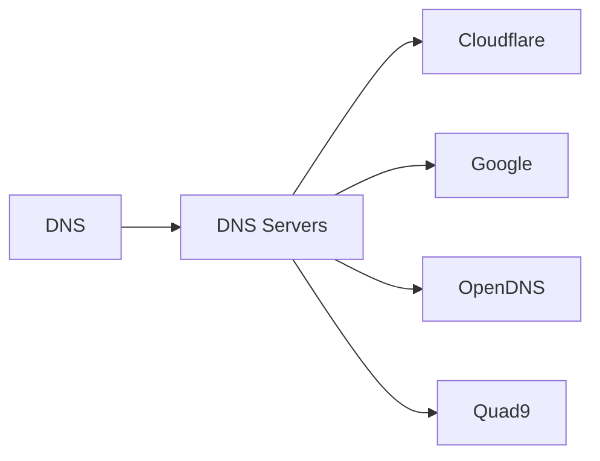

# Name Resolution

DNS theory first, then public resolvers you will actually configure.

| Note | Role |
|------|------|
| [[DNS]] | Hierarchical name system |
| [[DNS-Servers/Index|DNS Servers]] | Cloudflare · Google · OpenDNS · Quad9 |

← [[03-Application-Protocols/Index|Application Protocols]]
