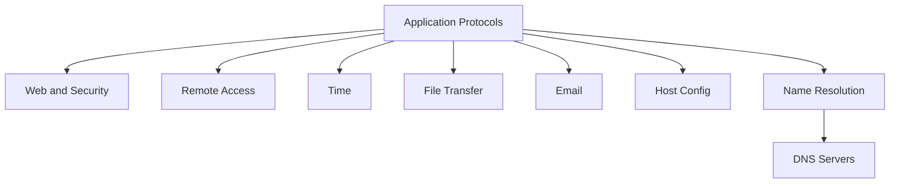

# Application Protocols — Map of Content

Services users and engineers configure, filter, and debug — nested by job.

## Nested map

## Study order

1. [[07-Name-Resolution/Index|Name Resolution]] — [[DNS]] → [[DNS-Servers/Index|DNS Servers]]
2. [[06-Host-Config/Index|Host Config]] — [[DHCP]]
3. [[01-Web-and-Security/Index|Web & Security]] — [[HTTP-HTTPS]] · [[SSL-TLS]]
4. [[02-Remote-Access/Index|Remote Access]] — [[SSH]]
5. [[03-Time/Index|Time]] — [[NTP]] · [[SNTP]]
6. [[04-File-Transfer/Index|File Transfer]] — [[FTP-SFTP]]
7. [[05-Email/Index|Email]] — [[SMTP-IMAP]]

## Quick port reference

| Topic | Ports |
|-------|-------|
| [[HTTP-HTTPS]] | 80 / 443 |
| [[SSH]] | 22 |
| [[SSL-TLS]] | wraps apps (esp. 443) |
| [[NTP]] / [[SNTP]] | 123/UDP |
| [[FTP-SFTP]] | 21 (+data) / 22 |
| [[SMTP-IMAP]] | 25/587 · 143/993 |
| [[DHCP]] | 67/68 UDP |
| [[DNS]] | 53 UDP/TCP |

← [[Home]] · Back: [[02-Core-Protocols/Index|Core Protocols]] · Next: [[04-Building-a-Network/Index|Building a Network]]

Next: [[04-Network-Security/Index|Network Security]]
