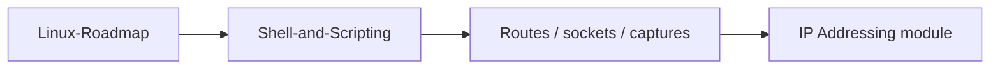

# Linux for Networking

Host‑side skills that make CCNA fabric knowledge **provable** from real endpoints.

## Analogy

> Routers and switches are the **rail network**. Linux CLI is the **station master’s console**: if you can’t read arrivals (`ss`), track circuits (`ip route`), and CCTV (`tcpdump`), timetable theory ([[Shell-and-Scripting]] concepts) never saves a delayed train.

## Study order

1. [[Linux-Roadmap]] — why Linux, how to scope learning
2. [[Shell-and-Scripting]] — daily toolkit and small scripts

## Child notes

| Note | One-line idea |
|------|----------------|
| [[Linux-Roadmap]] | Networking slice of Linux; optional roadmap.sh spine |
| [[Shell-and-Scripting]] | `ip`/`ss`/`ping`/`tcpdump`/`nmcli` + bash inventory loops |

← [[04-Building-a-Network/Index|Building a Network]] · Next: [[02-IP-Addressing/Index|IP Addressing]]
