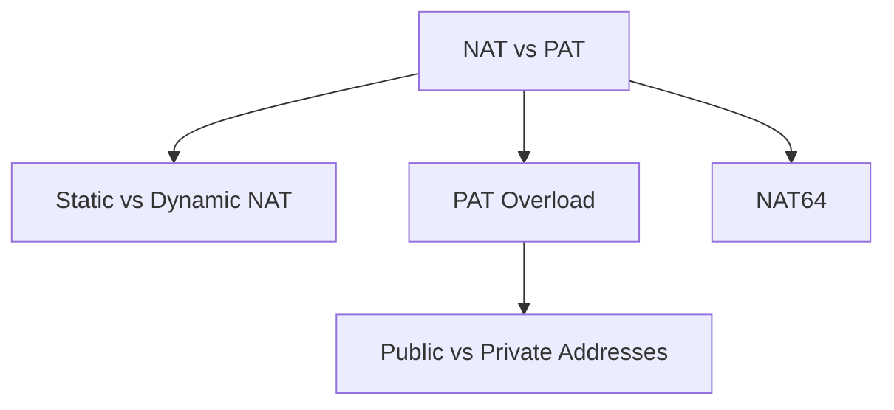

# NAT

Address (and often port) translation at network boundaries — mostly an IPv4 survival tool, plus family translation for IPv6‑mostly access.

## Analogy

> NAT is the **border checkpoint stamp**: sometimes a permanent VIP pass ([[Static-vs-Dynamic-NAT]]), sometimes a shared tourist lanyard with unique serials ([[PAT-NAT-Overload]]), and sometimes a bilingual stamp that converts Metric ↔ Imperial paperwork ([[NAT64]]).

## Study order

1. [[NAT-vs-PAT]] — umbrella comparison
2. [[Static-vs-Dynamic-NAT]] — 1:1 permanent vs pool
3. [[PAT-NAT-Overload]] — many‑to‑one (what you use daily)
4. [[NAT64]] — IPv6 clients → IPv4 servers

## Child notes

| Note | One-line idea |
|------|----------------|
| [[NAT-vs-PAT]] | NAT umbrella vs port overload |
| [[Static-vs-Dynamic-NAT]] | 1:1 fixed vs pool |
| [[PAT-NAT-Overload]] | Many private → one public + ports |
| [[NAT64]] | Family translation with DNS64 |

← [[02-IP-Addressing/Index|IP Addressing]] · [[Public-vs-Private-Addresses]]
