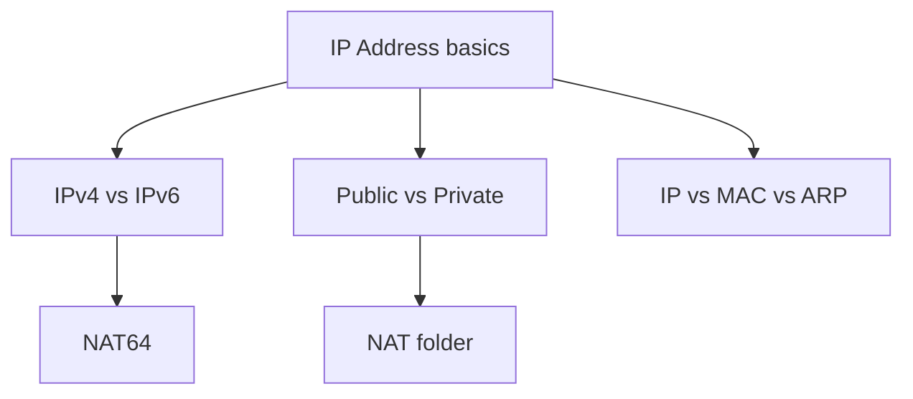

# IP Addressing

How hosts get Layer‑3 identity, what is publicly routable, and how L3 ties to L2.

## Analogy

> Addressing is the **postal system** for packets: country codes vs apartment buzzers ([[IP-vs-MAC-vs-ARP]]), old 5‑digit zips vs new long codes ([[IPv4-vs-IPv6]]), and “inside the gated complex” vs “city street” ([[Public-vs-Private-Addresses]]). NAT (next folder) is the **front desk rewrite**.

## Study order

1. Review [[IP Address]] (basics from terminology module)
2. [[IPv4-vs-IPv6]]
3. [[Public-vs-Private-Addresses]]
4. [[IP-vs-MAC-vs-ARP]]
5. Dive into [[01-NAT/Index|NAT]]

## Child notes

| Note | One-line idea |
|------|----------------|
| [[IPv4-vs-IPv6]] | Formats, headers, dual stack |
| [[Public-vs-Private-Addresses]] | RFC1918, public space, CGNAT |
| [[IP-vs-MAC-vs-ARP]] | L3 vs L2 vs resolution |
| [[01-NAT/Index|NAT]] | Translate addresses at boundaries |

← [[04-Building-a-Network/Index|Building a Network]] · [[01-Linux-for-Networking/Index|Linux]] · Next: [[03-Subnetting/Index|Subnetting]]
