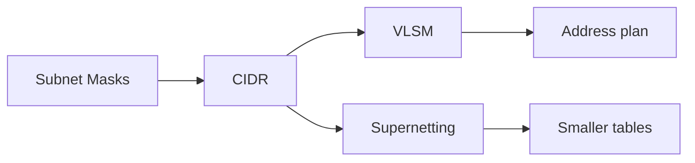

# Subnetting

The math and design language of carving, naming, and aggregating IPv4 (and thinking in prefixes for IPv6).

## Analogy

> Addressing space is a **plot of land** ([[CIDR]] deed). [[Subnet-Masks]] survey the fences. [[VLSM]] divides uneven lots for different houses. [[Supernetting]] puts one big sign on the highway for the whole development so distant routers don’t memorize every driveway.

## Study order

1. [[Subnet-Masks]] — network vs host bits
2. [[CIDR]] — slash notation & classless thinking
3. [[VLSM]] — unequal subnet sizing
4. [[Supernetting]] — route aggregation

## Child notes

| Note | One-line idea |
|------|----------------|
| [[Subnet-Masks]] | Stencil separating network vs host |
| [[CIDR]] | Prefix lengths replace classful rules |
| [[VLSM]] | Different sizes from one parent block |
| [[Supernetting]] | Summarize contiguous prefixes |

← [[04-Building-a-Network/Index|Building a Network]] · [[02-IP-Addressing/Index|IP Addressing]]
