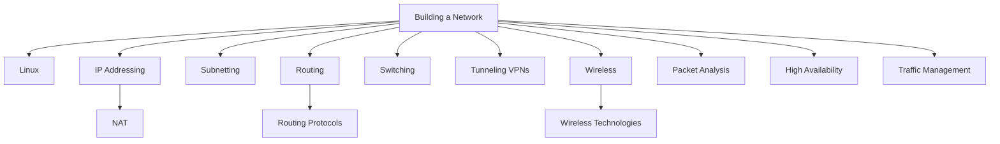

# Building a Network — Map of Content

This is **module 04** — how you actually **design and operate** networks: addressing, subnetting, routing, switching, wireless, tunnels, HA, and traffic control. Study after [[00-Networks-and-Devices/Index|Networks & Devices]], terminology, and core/app protocols.

## Analogy for the whole module

> Modules 00–03 taught you the **city map and traffic laws**. This module is the **civil engineering**: survey the land ([[03-Subnetting/Index|Subnetting]]), pave roads ([[04-Routing/Index|Routing]] / [[05-Switching/Index|Switching]]), put up radio cells ([[07-Wireless-Networking/Index|Wireless]]), dig secure tunnels ([[06-Tunneling-and-VPNs/Index|Tunneling & VPNs]]), keep bridges from collapsing ([[09-High-Availability/Index|High Availability]]), and manage rush hour ([[10-Traffic-Management/Index|Traffic Management]]) — while reading the CCTV ([[08-Packet-Analysis/Index|Packet Analysis]]) when something breaks.

## Sections

1. [[01-Linux-for-Networking/Index|Linux for Networking]] — shell toolkit for real ops
2. [[02-IP-Addressing/Index|IP Addressing]] — IPv4/IPv6, public/private, L2/L3 identity · [[02-IP-Addressing/01-NAT/Index|NAT]]
3. [[03-Subnetting/Index|Subnetting]] — masks, CIDR, VLSM, supernetting
4. [[04-Routing/Index|Routing]] — static/dynamic, gateways, protocols, SD-WAN, VRFs
5. [[05-Switching/Index|Switching]] — VLANs, STP, EtherChannel, MAC tables, VXLAN
6. [[06-Tunneling-and-VPNs/Index|Tunneling & VPNs]] — IPsec/SSL, site/remote, GRE, MPLS VPN
7. [[07-Wireless-Networking/Index|Wireless Networking]] — Wi‑Fi design + other radio tech
8. [[08-Packet-Analysis/Index|Packet Analysis]] — prove faults on the wire
9. [[09-High-Availability/Index|High Availability]] — FHRP, load balancers
10. [[10-Traffic-Management/Index|Traffic Management]] — QoS, shaping, prioritization

## Study order

1. [[01-Linux-for-Networking/Index|Linux]] → [[Shell and Scripting]] (your daily tools)
2. [[02-IP-Addressing/Index|IP Addressing]] → [[02-IP-Addressing/01-NAT/Index|NAT]]
3. [[03-Subnetting/Index|Subnetting]] until you can VLSM under pressure
4. [[05-Switching/Index|Switching]] then [[04-Routing/Index|Routing]]
5. [[06-Tunneling-and-VPNs/Index|VPNs]] · [[07-Wireless-Networking/Index|Wireless]]
6. [[08-Packet-Analysis/Index|Packet Analysis]] (use on every lab)
7. [[09-High-Availability/Index|HA]] · [[10-Traffic-Management/Index|Traffic Management]]

← [[Home]] · Back: [[03-Application-Protocols/Index|Application Protocols]]
