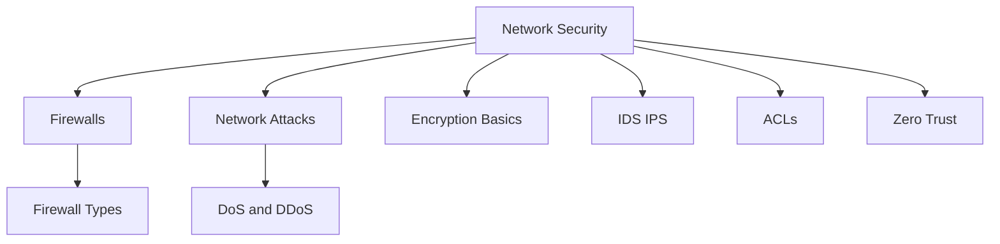

# Network Security — Cybersecurity Roadmap

Security for network engineers: control traffic, detect abuse, encrypt what matters, and design for least privilege.

## Analogy for the whole module

> Your network is a **city**. Security is not one lock — it’s **gates ([[Firewalls]] / [[ACLs]])**, **cameras and guards ([[IDS IPS]])**, **sealed courier pouches ([[Encryption Basics]])**, **knowing smash-and-grab patterns ([[DoS DDoS]])**, and a culture of **never trusting a badge just because someone is “inside” ([[Zero Trust Architecture]])**.

## Map

## Study order

1. [[01-Firewalls/Index|Firewalls]] — types first (how gates think)
2. [[ACLs]] — policy language on routers/switches/firewalls
3. [[IDS IPS]] — detect vs block
4. [[Encryption Basics]] — confidentiality & integrity
5. [[02-Network-Attacks/Index|Network Attacks]] → [[DoS DDoS]]
6. [[Zero Trust Architecture]] — modern design mindset

## Sections

| Section | Notes |
|---------|--------|
| [[01-Firewalls/Index\|Firewalls]] | Packet Filtering · Stateful · NGFW · Proxy · Circuit-Level · WAF |
| [[02-Network-Attacks/Index\|Network Attacks]] | DoS & DDoS (defensive mastery) |
| [[Encryption Basics]] | What to encrypt, where, and common pitfalls |
| [[IDS IPS]] | Detection vs prevention |
| [[ACLs]] | Permit/deny logic engineers live in |
| [[Zero Trust Architecture]] | Never trust, always verify |

← [[Home]] · Prev: [[03-Application-Protocols/Index|Application Protocols]]
