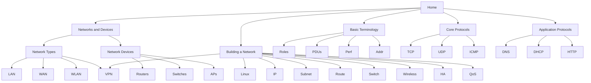

# Home Labbing CCNA — Vault Home

This vault is your **networking mastery workspace**. Read it in Obsidian locally, or on the web at `alubaid.xyz/notes/` (unlisted — no homepage link).

First-time Obsidian setup: [[Obsidian-Setup]]

## Curriculum (nested)

0. [[00-Networks-and-Devices/Index|Networks & Devices]] ← **start here**
   - [[01-Network-Types/Index|Network Types]] · [[02-Network-Devices/Index|Network Devices]]
1. [[01-Basic-Terminology/Index|Basic Terminology]]
   - Roles · Data Units · Performance · Addressing · Physical
2. [[02-Core-Protocols/Index|Core Protocols]] — [[TCP]] · [[UDP]] · [[ICMP]]
3. [[03-Application-Protocols/Index|Application Protocols]]
   - Web · Remote Access · Time · File Transfer · Email · Host Config · [[07-Name-Resolution/Index|Name Resolution]] → [[DNS-Servers/Index|DNS Servers]]
4. [[04-Building-a-Network/Index|Building a Network]] ← **design & ops spine**
   - Linux · IP/NAT · Subnetting · Routing · Switching · VPNs · Wireless · Packet Analysis · HA · Traffic Mgmt



## How these notes teach

Every mastery note aims for:
1. **Analogy** — concrete picture first
2. **Definition** — precise engineer language
3. **Mechanism** — how it works on the wire
4. **Labs + troubleshooting** — prove it

## Graph view tip

Graph filter should hide `ai/` (context + logs), `roadmap-extracts`. Color groups separate modules `00`–`04`.

If filters reset: paste this into Graph → Filter search:

```text
-path:ai -path:roadmap-extracts -path:Templates -path:GNS3 -path:.cursor -path:bash-learn -path:my_directory
```

## Reference & labs

- [[Become-Genuinely-Dangerous-at-Networking]] · [[Network-Engineer-Roadmap]] → `90-Reference/`
- `GNS3/` · `Templates/Mastery-Note.md` · `Attachments/`

## Progress

- [ ] Networks & Devices checklists (types + devices)
- [ ] Basic Terminology checklists
- [ ] TCP / UDP / ICMP labs + captures
- [ ] Application protocol labs
- [ ] Compare Cloudflare / Google / OpenDNS / Quad9 with `dig`
- [ ] Building a Network: subnetting + VLAN/STP labs
- [ ] Building a Network: OSPF + NAT + VPN lab
- [ ] Building a Network: Wireshark methodology on a real fault
